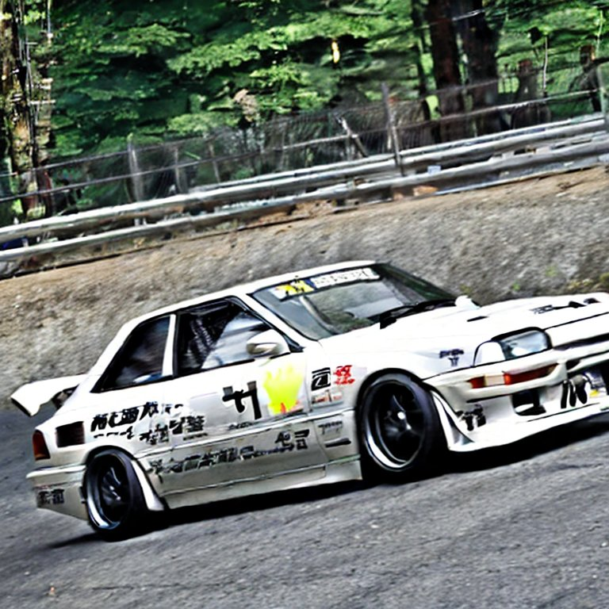
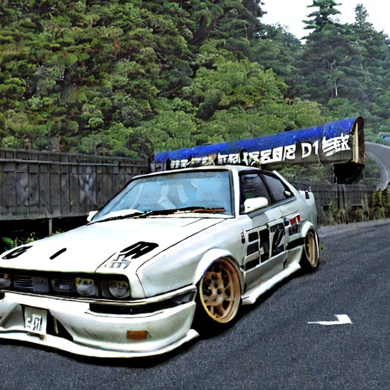

# J-dive - Endless Runner Game

## Описание

J-dive - это игра в жанре "Endless Runner", в которой игрок управляет японским автопромом, погружаясь в культуру нелегальных японских горных уличных гонок - Touge. Игра сочетает в себе динамичный геймплей, красочную, минималистичную графику и захватывающую музыку, чтобы создать драйвовый опыт игры.




## Как начать игру

Клонируйте репозиторий:

```bash
git clone https://github.com/Priscilla-Custom-Effects/J-dive.git
```

Откройте проект в Unity и запустите сцену.
Нажмите кнопку "Play" для запуска игры.

## Управление и геймплей

Используйте клавиши WASD или стрелки для управления движением персонажа.
Избегайте препятствий и пытайтесь пройти как можно большее расстояния.

## Функции

1. Бесконечная езда: Продолжайте ехать, избегая препятствий, пока не проиграете.
2. Увлекательный геймплей: Динамичные сцены и разнообразные препятствия для поддержания интереса игрока.
3. Система очков: За каждое пройденное расстояние игрок получает очки.
4. Графика и звук: Приятные визуальные и звуковые эффекты, чтобы сделать игровой процесс.

## Требования

Совместимо с Windows и Android.

## Вклад в разработку

Если вы хотите внести свой вклад в развитие игры J-dive, пожалуйста, следуйте процессу запроса на Pull Request. Мы приветствуем любые улучшения и новые идеи!

## Лицензия

J-dive распространяется под лицензией GPL-3.0 license.
